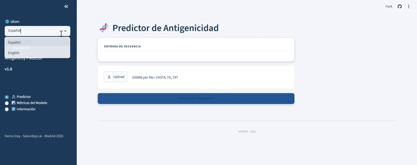

# 🧬 AiGenix: Antigenicity Predictor

**Protein antigenicity classifier using Machine Learning.**  
Final project of the [Saturdays.AI](https://saturdays.ai) Machine Learning track.

[](https://aigenix.streamlit.com)
[](https://www.python.org/)
[](https://scikit-learn.org/)
[](https://biopython.org/)



---

## What does this project do?

Given a FASTA file containing protein sequences from a pathogen, the system predicts which ones are most likely to be **antigenic** — that is, recognized by the human immune system.

The output is a ranked table of antigenicity scores (0–1) per protein, plus a sorted bar chart of candidates. Each prediction is accompanied by a **natural language explanation** generated by Gemini 2.0 Flash, offering biological reasoning behind the score.

This kind of tool could be used as a fast in silico filter to prioritize vaccine candidate antigens, reducing the initial search time. **It does not replace experimental assays or clinical trials.**

---

## Context and motivation

This is an educational Machine Learning project applied to bioinformatics. The goal is to build a complete pipeline — from obtaining and cleaning real data to deploying a functional web interface — while learning to critically evaluate the results.

The pathogens used as case studies are **SARS-CoV-2** and **Influenza A**, chosen for their clinical relevance and the abundance of available experimental data.

📖 **Full technical write-up:** [Cazando antígenos con Machine Learning: cómo construimos AiGenix](https://medium.com/@magnitopic/cazando-ant%C3%ADgenos-con-machine-learning-c%C3%B3mo-construimos-aigenix-b76ff5ad5821)

---

## The pipeline

The project is structured as five sequential notebooks, each producing a concrete artifact:

```
download_files → 00_acquisition → 01_exploration → 02_construction → 03_model
      ↓                ↓                ↓                 ↓               ↓
  raw data         CSV filtered    protein_labels      dataset.csv     model.pkl
  (3.9 GB)          (29 MB)        (1,365 prot.)      (1,310 prot.)   (RF + meta)
```

- **download_files** — Downloads the three raw IEDB export files (~3.9 GB total): T-cell, B-cell, and antigen assays.
- **00_acquisition** — Processes files in 100k-row chunks, retains only the 5 relevant columns, filters to SARS-CoV-2 and Influenza A. Reduces data by 99.3% (to 158,289 assays / 29 MB).
- **01_exploration** — Shifts the unit of analysis from epitopes to proteins. Labels each protein: `1` if it has at least one positive assay, `0` if all assays are negative. Produces 1,365 labeled proteins.
- **02_construction** — Fetches full amino acid sequences from UniProt and NCBI APIs, calculates 24 physicochemical features per protein with Biopython. Produces `dataset.csv` (1,310 × 29).
- **03_model** — Trains and evaluates three classifiers. Produces `model.pkl`.

---

## Dataset

**Source:** [IEDB — Immune Epitope Database](https://www.iedb.org)

IEDB is a free, public database containing experimental epitope data: protein fragments recognized by the immune system in laboratory assays. It is maintained by the National Institute of Allergy and Infectious Diseases (NIAID) of the United States.

**Dataset construction strategy:**

1. Download of the full IEDB export files (T-cell, B-cell, antigen assays).
2. Processing in chunks; filtering by organism (SARS-CoV-2 and Influenza A) and positive assay result.
3. Aggregation from 158,289 assays to 1,365 unique proteins.
4. Sequence retrieval from UniProt and NCBI (96% match rate → 1,310 proteins).
5. Binary labeling: `label = 1` for proteins with at least one experimentally validated epitope, `label = 0` for proteins from the same pathogen with no antigenicity evidence.

The resulting dataset has a 7:1 class imbalance (1,198 antigenic vs. 167 non-antigenic proteins), handled with `class_weight=balanced` in the model.

> **Note:** The raw IEDB files (~3.9 GB) are not included in this repository. They must be downloaded from [iedb.org/database_export_v3.php](https://www.iedb.org/database_export_v3.php).

---

## Model features

Calculated with **Biopython** from the amino acid sequence of each protein (24 features total):

| Feature | Description |
|---|---|
| Length | Number of amino acids |
| Amino acid composition | Percentage of each of the 20 standard amino acids |
| Molecular weight | In Daltons |
| Isoelectric point | pH at which the net charge of the protein is zero |
| Mean hydrophobicity | GRAVY index — negative values indicate hydrophilic proteins more likely to be surface-exposed |

No protein language model embeddings or 3D structure features are used.

**Most predictive features:** Molecular weight and GRAVY index consistently led feature importance rankings. The model effectively learned that hydrophilic proteins (negative GRAVY) tend to be surface-exposed on the virus, making them more accessible to the immune system — without ever seeing a 3D structure.

---

## Model

- **Main algorithm:** Random Forest (200 trees, `class_weight=balanced`)
- **Validation:** Stratified cross-validation (k=5) + independent hold-out test set (20%)
- **Baselines:** Majority classifier and Logistic Regression
- **Serialization:** `models/model.pkl` with joblib

### Results

| Model | AUC-ROC (CV) | AUC-ROC (Test) | F1-score (Test) | Recall (Test) |
|---|---|---|---|---|
| **Random Forest** | **0.72 ± σ** | **0.65** | **0.943** | **1.0** |

The most important result is **Recall = 1.0 on the independent test set**: the model detected 100% of antigenic proteins without a single false negative. In a vaccine candidate screening context, this means no potential antigen is discarded in the initial filter — which is the critical safety property for this use case.

The drop from CV AUC (0.72) to test AUC (0.65) reflects a known structural limitation: antigenicity depends on the 3D folded surface of the protein, which sequence-only features can only approximate statistically.

---

## App features

- Upload any FASTA file with protein sequences
- Instant antigenicity score (0–1) per protein, ranked by likelihood
- Bar chart visualization of candidates
- **AI-powered biological explanation** for each prediction, generated by Gemini 2.0 Flash

Live at **[aigenix.streamlit.app](https://aigenix.streamlit.com)**

---

## Repository structure

```
AIGENIX/
│
├── app/
│   └── app.py
│
├── assets/
│   
├── data/
│   └── processed/
│   └── raw/
│
├── docs/
│   └── glossary_of_terms.md
│   └── project_viability_analysis.md
│
├── models/
│   └── best_model_mvp.pkl
├── notebooks/
│   ├── download_files.ipynb
│   ├── 00_acquisition.ipynb
│   ├── 01_exploration.ipynb
│   ├── 02_construction.ipynb
│   └── 03_model.ipynb
│   └── 04_model_comparison.ipynb
│   └── 05_overfitting_analysis.ipynb
│
├── sample_input/
│   └── influenza_a_h1n1.fasta
│   └── sars_cov2_structurals.fasta
│
├── src/
│   └── train_model_mvp.py
│
├── main.py
├── check_model.py
├── pyproject.toml
└── README.md
```

---

## Requirements

```
Python 3.9+
biopython
scikit-learn
pandas
matplotlib
streamlit
joblib
```

Installation:

```bash
pip install biopython scikit-learn pandas matplotlib streamlit joblib
```

---

## How to use

**Model training:**  
Run the notebooks in order from Google Colab: `download_files → 00 → 01 → 02 → 03`.

**Web interface:**  
```bash
cd app
streamlit run app.py
```

Or access the deployed app directly at **[aigenix.streamlit.app](https://aigenix.streamlit.com)**.

Upload a FASTA file with the proteins to evaluate. The app loads the saved model and returns the ranked score table, the chart, and a Gemini-generated biological explanation per protein.

---

## Limitations

- The model is trained exclusively on SARS-CoV-2 and Influenza A data. Its ability to generalize to other pathogens is unknown.
- Features are based solely on sequence. 3D structure, glycosylation, and cellular processing are not considered.
- The dataset contains label noise: proteins labeled as non-antigenic may simply be understudied, not truly non-antigenic. In immunology, absence of evidence is not evidence of absence.
- A high score does not guarantee that a protein is a good vaccine antigen. It is an indicative filter, not a clinical predictor.

---

## The team

Developed as the capstone project of the [Saturdays.AI](https://saturdays.ai) Machine Learning track — Madrid edition.

| Name | LinkedIn | GitHub |
|---|---|---|
| Iris Amorim | [LinkedIn](https://www.linkedin.com/in/irisamorim/) | [GitHub](https://github.com/IrisFernandaAmorim) |
| Alejandro Aparicio | [LinkedIn](https://www.linkedin.com/in/magnitopic/) | [GitHub](https://github.com/magnitopic) |
| Joaquin Lazaro | [LinkedIn](https://www.linkedin.com/in/joaquin-lazarom/) | [GitHub](https://github.com/JoaquinLazaro26) |

---

## Contributing

We welcome contributions of all kinds — bug reports, feature suggestions, improvements to the model or the app.

---

## About Saturdays.AI

[Saturdays.AI](https://saturdays.ai) is a global, volunteer-driven program where participants learn machine learning by building real projects over the course of several weeks. This project was developed as the capstone project of the Machine Learning track.
